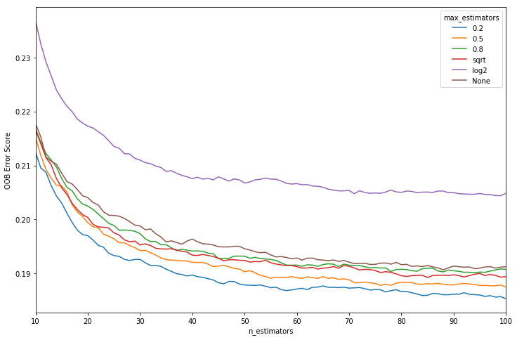

# Pump it Up: Data Mining the Water Table
## My analysis for the Driven Data competition

By [Ville Heilala](https://heila.la), 2017

## Research question

The [Driven Data competition](https://www.drivendata.org/competitions/7/pump-it-up-data-mining-the-water-table/) describes the question as follows:

>Can you predict which water pumps are faulty?

>Using data from Taarifa and the Tanzanian Ministry of Water, can you predict which pumps are functional, which need some repairs, and which don't work at all? ... Predict one of these three classes based on a number of variables about what kind of pump is operating, when it was installed, and how it is managed. A smart understanding of which waterpoints will fail can improve maintenance operations and ensure that clean, potable water is available to communities across Tanzania.

   
  Picture: <a href="https://commons.wikimedia.org/wiki/File:Flickr_-_usaid.africa_-_Water_pump_provided_by_USAID.jpg">Wikimedia Commons</a>

## The data

Data can be obtained from the competition site by registering and downloading the data sets. Data set contains training variables, labels and test set for participating the competition. Total data size is 74250 observations, 40 independent variables and 1 dependent variable. Predicted status group can be either "functional", "non functional" or "functional needs repair".

## Tools

* [Anaconda](https://www.continuum.io/) + [Jupyter](http://jupyter.org/)
* [Numpy](http://www.numpy.org/) Stack, pandas, [scikit-learn](http://scikit-learn.org/stable/)

## Methods

* basic exploration methods
* [Random Forest](random_forest.md)
* DBSCAN

## Workflow

I'm using analysis workflow prensented in [this](https://www.quora.com/What-is-the-workflow-or-process-of-a-data-scientist) Quora answer.

### 1. Ask A Question

This question is provided by the competition.

>Can you predict which water pumps are faulty?

### 2. Get the Data

* [Jupyter notebook: Get the data](pumpitup_getdata.ipynb)

### 3. Explore the Data

* [Jupyter notebook: Explore the data](pumpitup_explore.ipynb)

### 4. Model the data

* [Jupyter notebook: Preprocess the data I: Get missing gps_height values](pumpitup_missing_gps_height.ipynb)
* [Jupyter notebook: Preprocess the data II: Process variables](pumpitup_preprocess.ipynb)
* [Jupyter notebook: Modet the data I: Optimize metaparameters](pumpitup_model_metaparameters.ipynb)

Optimizing max_features parameter, which is the number of features to consider when looking for the best split

* [Jupyter notebook: Model the data](pumpitup_model.ipynb)

### 5. Communicate the data

### 6. Implementation

### 7. Test and quantify your impact

## Results
